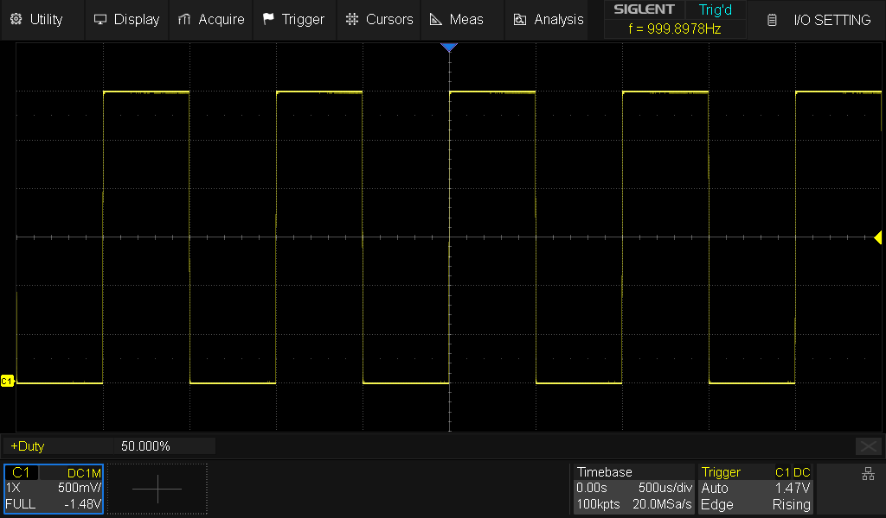

# SCPI Instrument Control

> **📦 Package Renamed!** This project was formerly known as `Siglent-Oscilloscope`. See the [Migration Guide](#migration-guide) below for updating your code.

[](https://github.com/little-did-I-know/SCPI-Instrument-Control/actions/workflows/ci.yml)
[](https://codecov.io/gh/little-did-I-know/SCPI-Instrument-Control)
[](https://pypi.org/project/SCPI-Instrument-Control/)
[](https://pypi.org/project/SCPI-Instrument-Control/)
[](https://pypi.org/project/SCPI-Instrument-Control/)
[](https://opensource.org/licenses/MIT)
[](https://github.com/psf/black)
[](https://github.com/little-did-I-know/SCPI-Instrument-Control/issues)
[](https://github.com/little-did-I-know/SCPI-Instrument-Control/stargazers)
[](https://github.com/little-did-I-know/SCPI-Instrument-Control/commits/main)
[](https://buymeacoffee.com/little.did.i.know)

A universal Python library for controlling SCPI-compatible test equipment via Ethernet/LAN (plus USB, GPIB, and serial through the optional VISA backend). It drives oscilloscopes from Siglent, Tektronix, and LeCroy alongside function generators (AWGs), power supplies, and data-acquisition units through one programmatic API — with a high-performance PyQt6 GUI, a browser-based lab gateway, provenance-stamped waveform files, automated PDF/Markdown test reports with local-LLM analysis, and a realistic mock layer that synthesizes state-coupled waveforms so the whole stack can be developed and demoed without an instrument attached.

<p align="center">
  
  <br>
  <em>A live screen capture pulled over LAN from a Siglent SDS824X&nbsp;HD (its 1&nbsp;kHz calibration square wave), via <code>scope.screen_capture.get_screenshot_pil()</code>.</em>
</p>

## Features

### Core Features

- **Programmatic API**: Control your oscilloscope from Python scripts
- **Multi-Vendor Oscilloscope Support**: Siglent (legacy SDS1000X-E/SDS2000X Plus and modern SDS800X HD/SDS5000X dialects), Tektronix, and LeCroy, auto-detected from `*IDN?`
- **Power Supply & DAQ Support**: drive Siglent SPD-series power supplies and SCPI data-acquisition/data-logger units alongside the scope
- **Automation & Data Collection**: High-level API for batch capture, continuous monitoring, and analysis
- **GUI Application**: Modern PyQt6-based graphical interface
- **Waveform Acquisition**: Capture and download waveform data in multiple formats (.npz, .csv, .mat, .h5)
- **Acquisition Provenance**: every saved waveform records the instrument, settings, and timestamp that produced it; extract raw data from any saved file with load_waveform() or the scpi-extract CLI
- **Synthetic Signals & Realistic Mock**: generate parameterized test waveforms (sine/square/triangle/ramp/DC/noise) with `SignalSpec`/`make_waveform`, or `synthesize()`/`stream()` for one-shot arrays and phase-continuous, optionally real-time-paced chunks; develop without hardware against a mock scope that synthesizes state-coupled, trigger-aligned waveforms by default
- **Channel Configuration**: Control voltage scale, coupling, offset, bandwidth
- **Trigger Settings**: Configure trigger modes, levels, edge detection
- **Advanced Analysis**: Built-in FFT, SNR, THD, and statistical analysis tools

### GUI Features (New!)

- **High-Performance Live View**: Real-time waveform display (5-20 fps, configurable) using PyQtGraph
- **Interactive Visual Measurements**: Click-and-drag measurement markers directly on waveforms
  - 15+ measurement types: Frequency, Vpp, Rise Time, Duty Cycle, etc.
  - Visual gates and markers with real-time calculation
  - Save/load measurement configurations
  - Export results to CSV/JSON
- **Non-Blocking Updates**: Threaded data acquisition keeps GUI responsive
- **Reference Waveforms**: Save, overlay, and compare waveforms
- **Protocol Decoding**: I2C, SPI, UART, CAN, LIN support
- **Math Functions**: Custom math expressions on waveforms
- **VNC Display**: Embedded oscilloscope screen viewer

### Automated Test Report Generation 📊

**Automatically generate comprehensive PDF and Markdown test reports** from your waveform captures with detailed analysis, visualizations, and AI-powered insights. Perfect for documentation, test validation, and automated quality control.

```python
# Install report generator dependencies
# pip install "SCPI-Instrument-Control[report-generator]"

from datetime import datetime
from pathlib import Path

from scpi_control.report_generator.generators.markdown_generator import MarkdownReportGenerator
from scpi_control.report_generator.generators.pdf_generator import PDFReportGenerator
from scpi_control.report_generator.models.report_data import ReportMetadata, TestReport, TestSection, WaveformData

# time_data / voltage_data: your captured numpy arrays (e.g. from scope.get_waveform)
waveform = WaveformData(channel="CH1", time=time_data, voltage=voltage_data, sample_rate=1e6, record_length=len(voltage_data))

metadata = ReportMetadata(title="Probe Calibration Test Report", technician="Lab Technician", test_date=datetime.now(), equipment_model="SDS824X HD")
report = TestReport(metadata=metadata)
report.add_section(TestSection(title="Waveform Captures", waveforms=[waveform], order=1))
report.overall_result = report.calculate_overall_result()

MarkdownReportGenerator().generate(report, Path("calibration_report.md"))
PDFReportGenerator().generate(report, Path("calibration_report.pdf"))
```

**Key Features:**

- ✅ **Automatic Signal Detection** - FFT-based classification (sine, square, triangle, pulse, etc.)
- ✅ **Comprehensive Statistics** - 25+ parameters including Vpp, RMS, frequency, SNR, THD, jitter, overshoot
- ✅ **Template Presets** - Ready-made report templates such as `ReportTemplate.create_probe_calibration_template()`, manageable from the GUI's Template Manager
- ✅ **Local-LLM Analysis** - Optional AI insights and Q&A tool-calling via Ollama running on your own machine (no cloud providers, no API keys)
- ✅ **Region Extraction** - Zoom into plateaus, edges, and transients with calibration guidance
- ✅ **Multiple Formats** - Generate PDF and Markdown reports with embedded plots
- ✅ **Professional Layout** - Publication-ready reports with metadata, statistics tables, and visualizations

**Report Sections Include:**

- Test metadata (title, ID, operator, timestamp, scope model)
- Waveform plots with automatic scaling
- Signal classification and characteristics
- Detailed measurement tables
- Region-of-interest analysis with zoomed views
- AI-generated insights and recommendations (optional)
- Pass/fail criteria and test conclusions

See `examples/probe_calibration_analysis.py` for complete examples including region extraction and automated probe compensation guidance.

### Vector Graphics / XY Mode (Fun! 🎨)

Use your oscilloscope as a vector display by generating waveforms for XY mode:

- **Draw Shapes**: Circles, rectangles, stars, polygons, Lissajous figures
- **Text Rendering**: Display text messages on your oscilloscope screen
- **Animations**: Create rotating and transforming graphics
- **Composite Paths**: Combine multiple shapes into complex drawings

**Requirements**: External AWG/DAC or scope's built-in AWG to feed generated waveforms into scope channels.

```python
# Install the fun extras
# pip install "SCPI-Instrument-Control[fun]"

from scpi_control import Oscilloscope
from scpi_control.vector_graphics import Shape

scope = Oscilloscope('192.168.1.100')
scope.connect()

# Enable XY mode (CH1=X, CH2=Y)
scope.vector_display.enable_xy_mode()

# Generate waveforms for a circle
circle = Shape.circle(radius=0.8, points=1000)
x_wave, y_wave = scope.vector_display.draw(circle)

# Save for AWG upload
scope.vector_display.save_waveforms(circle, "my_circle", format='csv')
# Load my_circle_x.csv and my_circle_y.csv into your AWG!
```

See `examples/vector_graphics_xy_mode.py` for more demos including animations and text!

## Installation

### From PyPI (recommended)

```bash
pip install SCPI-Instrument-Control
```

To include optional features, use extras:

```bash
# GUI application with PyQt6
pip install "SCPI-Instrument-Control[gui]"

# Automated report generation (PDF/Markdown with AI analysis)
pip install "SCPI-Instrument-Control[report-generator]"

# Vector graphics and XY mode (draw shapes on scope!)
pip install "SCPI-Instrument-Control[fun]"

# Browser-based lab gateway (scpi-web)
pip install "SCPI-Instrument-Control[web]"

# USB/GPIB/serial instruments via PyVISA
pip install "SCPI-Instrument-Control[usb]"

# Everything
pip install "SCPI-Instrument-Control[all]"
```

**Note**: The `siglent-gui` command includes automatic dependency checking. If you try to run the GUI without the required packages, you'll receive a clear error message with installation instructions. Missing optional dependencies (like PyQtGraph for high-performance live view) will trigger warnings but allow the GUI to launch.

### Command-line tools

| Command | Description |
| --- | --- |
| `siglent-gui` | Launch the PyQt6 GUI application |
| `siglent-report-generator` | Launch the standalone report-generator app |
| `scpi-web` | Serve the browser-based lab gateway (REST + WebSocket API, optional web UI) |
| `scpi-extract` | Inspect or export a saved waveform file from the command line |

### From source

```bash
git clone git@github.com:little-did-I-know/SCPI-Instrument-Control.git
cd SCPI-Instrument-Control
pip install -e .
```

Install with GUI support from source:

```bash
pip install -e ".[gui]"
```

### Development installation

```bash
pip install -e ".[dev]"
```

### Build & Publish (PyPI)

To create release artifacts that render correctly on PyPI:

```bash
python -m build
twine check dist/*
```

The `twine check` command validates the built distributions, including the long description rendered from `README.md`, before upload.

## Migration Guide

**v1.0.0** introduces a package rename from `Siglent-Oscilloscope` to `SCPI-Instrument-Control` to better reflect the expanded capabilities of this library.

### For Existing Users

If you're upgrading from the old `siglent` package:

#### 1. Update Your Installation

**Uninstall the old package** (if installed):

```bash
pip uninstall siglent
```

**Install the new package**:

```bash
pip install SCPI-Instrument-Control
```

Or with extras:

```bash
pip install "SCPI-Instrument-Control[gui]"
pip install "SCPI-Instrument-Control[all]"
```

#### 2. Update Your Import Statements

**Old imports** (no longer work as of v2.0.0):

```python
from siglent import Oscilloscope, PowerSupply, FunctionGenerator
from siglent.gui.app import main
from siglent.waveform import Waveform
```

**New imports** (recommended):

```python
from scpi_control import Oscilloscope, PowerSupply, FunctionGenerator
from scpi_control.gui.app import main
from scpi_control.waveform import Waveform
```

#### 3. Backward Compatibility

The `siglent` compatibility shim was removed in **v2.0.0** (it had emitted a
`DeprecationWarning` since v1.0.0). `import siglent` now raises
`ModuleNotFoundError` — update your imports to `scpi_control` as shown above;
the API is otherwise identical. If you cannot migrate yet, pin
`SCPI-Instrument-Control<2.0`.

#### 4. Command-Line Tools

The CLI commands remain **unchanged** for convenience:

```bash
siglent-gui                    # Still works!
siglent-report-generator       # Still works!
```

No changes needed to scripts or automation that invoke these commands.

#### 5. What Changed

| Old | New | Status |
|-----|-----|--------|
| PyPI package: `siglent` | PyPI package: `SCPI-Instrument-Control` | **Changed** |
| `import siglent` | `import scpi_control` | **Required since v2.0.0** |
| `siglent-gui` command | `siglent-gui` command | **Unchanged** |
| `siglent-report-generator` command | `siglent-report-generator` command | **Unchanged** |

#### 6. Why the Rename?

This library has grown significantly beyond its original focus on Siglent oscilloscopes:

- **Multi-Instrument Support**: Oscilloscopes, power supplies, and function generators
- **Multi-Vendor Support**: Works with any SCPI-compatible equipment (not just Siglent)
- **Universal Protocol**: Based on industry-standard SCPI commands

The new name better represents what the library does: **control any SCPI-compatible test equipment**.

### Need Help?

If you encounter any migration issues:

- Check the [CHANGELOG.md](CHANGELOG.md) for detailed v1.0.0 release notes
- [Open an issue](https://github.com/little-did-I-know/SCPI-Instrument-Control/issues) on GitHub
- Review the updated [examples/](examples/) directory for new usage patterns

## Quick Start

### Programmatic Usage

```python
from scpi_control import Oscilloscope

# Connect to oscilloscope
scope = Oscilloscope('192.168.1.100')
scope.connect()

# Get device information
print(scope.identify())

# Configure channel 1
scope.channel1.set_scale(1.0)  # 1V/div
scope.channel1.set_coupling('DC')
scope.channel1.enable()

# Capture waveform
waveform = scope.get_waveform(channel=1)
print(f"Captured {len(waveform.time)} samples")

scope.disconnect()
```

### GUI Application

```bash
siglent-gui
```

Or from Python:

```python
from scpi_control.gui.app import main
main()
```

## Requirements

### Core Library

- Python 3.9+
- NumPy >= 1.24.0
- Matplotlib >= 3.7.0
- SciPy >= 1.10.0

### GUI Application (optional)

Install with `[gui]` extra to add:

- PyQt6 >= 6.6.0
- PyQt6-WebEngine >= 6.6.0
- PyQtGraph >= 0.13.0 (high-performance plotting)

### Optional Extras

- **Report Generator**: Install with `[report-generator]` to add PyQt6, Pillow, requests, ReportLab, Ollama (PDF/Markdown reports with AI)
- **HDF5 support**: Install with `[hdf5]` to add h5py >= 3.8.0
- **Vector Graphics**: Install with `[fun]` to add shapely, Pillow, svgpathtools (XY mode drawing)
- **Web Gateway**: Install with `[web]` to add FastAPI, Uvicorn, Pillow (browser-based lab gateway, `scpi-web`)
- **USB/GPIB/Serial**: Install with `[usb]` to add PyVISA + pyvisa-py (USB-TMC, GPIB, and serial instrument connections)
- **All features**: Install with `[all]` for complete functionality

## Connection

The oscilloscope must be connected to your network. The default SCPI port is 5025.

To find your oscilloscope's IP address:

1. Press **Utility** on the oscilloscope
2. Navigate to **I/O** settings
3. Check the **LAN** configuration

## GUI Application Overview

The SCPI Instrument Control GUI provides a comprehensive interface for controlling your oscilloscope, capturing waveforms, and performing measurements.

### Main Window


The main interface consists of:

- **Waveform Display**: High-performance real-time plotting area (center)
- **Control Panels**: Tabbed interface with all oscilloscope controls (right)
- **Menu Bar**: File operations, acquisition controls, and utilities (top)
- **Status Bar**: Connection status and system information (bottom)

### Getting Connected

To connect to your oscilloscope:

1. Launch the GUI: `siglent-gui`
2. Enter your oscilloscope's IP address
3. Click **Connect**

The oscilloscope must be connected to your network (default SCPI port: 5025).

**Finding your oscilloscope's IP address**:

- Press **Utility** on the oscilloscope
- Navigate to **I/O** settings
- Check the **LAN** configuration

### Channel Controls


The **Channels** tab provides complete control over all input channels:

- **Enable/Disable**: Toggle channels on/off with checkboxes
- **Voltage Scale**: Adjust volts/division (0.001V to 10V)
- **Coupling**: Set DC, AC, or GND coupling
- **Probe Ratio**: Configure probe attenuation (1X, 10X, 100X, etc.)
- **Bandwidth Limit**: Enable 20MHz bandwidth limiting
- **Offset**: Adjust vertical position

**Quick Tip**: Enable channels before starting Live View or capturing waveforms.

## GUI Application Guide

### Live View

The GUI features **high-performance real-time waveform viewing** powered by PyQtGraph:

```
Acquisition → Live View (Ctrl+R)
```

**Performance:**

- Real-time updates at 5-20 fps (configurable)
- 100x faster than traditional matplotlib-based viewers
- Non-blocking: GUI remains responsive during data acquisition
- Supports all 4 channels simultaneously

**Controls:**

- Enable channels in the "Channels" tab first
- Live view automatically acquires from enabled channels
- Adjust update rate by modifying `update_interval` in `live_view_worker.py`

### Visual Measurements


Interactive measurement markers that you can place and adjust directly on waveforms:

**How to use:**

1. Go to the **"Visual Measure"** tab
2. Select measurement type (Frequency, Vpp, Rise Time, etc.)
3. Select channel (CH1-CH4)
4. Click **"Add Marker"**
5. Marker auto-places on waveform
6. Drag marker gates to adjust measurement region
7. See real-time measurement updates

**Measurement Types:**

- **Frequency/Period**: Auto-detects signal period
- **Voltage**: Vpp, Amplitude, Max, Min, RMS, Mean
- **Timing**: Rise Time, Fall Time, Pulse Width, Duty Cycle

**Features:**

- **Save/Load Configs**: Save measurement setups for reuse
- **Export Results**: Export to CSV or JSON
- **Auto-Update**: Optional 1-second auto-refresh
- **Batch Mode**: Run multiple measurements simultaneously

**Example Workflow:**

```python
# In GUI:
# 1. Capture or enable live view
# 2. Visual Measure tab → Add Marker
# 3. Type: "Frequency", Channel: "CH1" → Add
# 4. Marker appears with measurement result
# 5. Save Config → "my_measurements.json"
# 6. Export Results → "results.csv"
```

### Automated Measurements


The **Measurements** tab provides quick access to standard oscilloscope measurements:

- 15+ measurement types (frequency, Vpp, RMS, rise time, etc.)
- Channel selection
- Results table with units
- Export measurement results

### Cursors


Interactive cursors for precise measurements:

- **Vertical cursors** for time measurements
- **Horizontal cursors** for voltage measurements
- **Delta calculations** (ΔT, ΔV, frequency)
- Draggable cursor lines
- Real-time delta updates

### FFT Analysis


Frequency domain analysis:

- Fast Fourier Transform visualization
- Peak detection and markers
- Window function selection (Hanning, Hamming, Blackman)
- Frequency and amplitude axes
- Export FFT data

### Vector Graphics 🎨 (XY Mode)

> **Requires**: `pip install "SCPI-Instrument-Control[fun]"`

Turn your oscilloscope into a vector display by generating waveforms for XY mode!

The **Vector Graphics** tab provides:

**Shape Generator:**

- **Basic Shapes**: Circle, Rectangle, Star, Triangle, Line
- **Lissajous Figures**: Classic oscilloscope patterns (3:2, 5:4, 7:5, etc.)
- **Parameter Controls**: Adjust size, points, frequency ratios, phase shifts
- **Generate Button**: Create vector paths with customizable parameters

**Waveform Export:**

- **Sample Rate Control**: 1-1000 MSa/s for AWG compatibility
- **Duration**: 1ms to 10s per waveform
- **Format Options**: CSV (universal), NumPy (.npy), Binary (.bin)
- **Save for AWG**: Exports separate X and Y waveform files

**XY Mode Control:**

- **Enable/Disable**: Configure oscilloscope for XY display mode
- **Channel Setup**: Auto-configures CH1 (X-axis) and CH2 (Y-axis)
- **Status Display**: Connection and configuration feedback

**How to use:**

1. Go to the **"Vector Graphics 🎨"** tab
2. Select a shape (e.g., "Circle" or "Lissajous")
3. Adjust parameters (radius, points, frequencies)
4. Click **"Generate Shape"**
5. Set sample rate and duration for your AWG
6. Click **"Save Waveforms..."** to export
7. Load the X/Y files into your AWG (Channel 1 = X, Channel 2 = Y)
8. Connect AWG outputs to scope inputs
9. Click **"Enable XY Mode"** or manually enable on scope
10. Watch your shape appear on the oscilloscope! ✨

**Works without scope connection** - you can generate and export waveforms offline!

**Example Use Cases:**

- Draw circles, stars, and geometric shapes
- Create classic Lissajous patterns for calibration
- Generate animations (rotating shapes, morphing patterns)
- Educational demonstrations of XY mode
- Signal generator pattern testing

See `examples/vector_graphics_xy_mode.py` for programmatic usage and animation examples.

### Other GUI Features

**Power Supply:**

- Dedicated **Power Supply** tab (`Connect to Power Supply...` menu action) for Siglent SPD-series and generic SCPI-99 power supplies
- Per-channel voltage/current setpoints, output enable, and readback

**Data Logger:**

- Dedicated **Data Logger** tab (`Connect to Data Logger...` menu action) for SCPI DAQ/data-acquisition units
- Channel scan configuration and readings display

**Terminal:**

- Built-in **Terminal** tab for sending raw SCPI commands directly to the connected instrument

**Reference Waveforms:**

- Save waveforms as references
- Overlay comparisons
- Difference mode (live - reference)
- Calculate correlation

**Math Channels:**

- Custom expressions: `C1 + C2`, `C1 * 2`, etc.
- Real-time calculation

**FFT Analysis:**

- Frequency domain visualization
- Window function selection
- Peak detection

**Protocol Decode:**

- I2C, SPI, UART, CAN, LIN decoding
- Packet analysis and export

## Web Gateway (beta)

Control instruments from any browser on your LAN:

```bash
pip install scpi-instrument-control[web]   # includes the browser gateway
scpi-web --host 0.0.0.0 --port 8765
```

Open `http://<gateway-pc>:8765`. Sessions can target real scopes by IP or a
built-in mock (`mock: true`) for hardware-free use. The API is documented at
`/docs` (OpenAPI). No authentication in this release — bind to `127.0.0.1`
(the default) unless your LAN is trusted.

Full documentation: [Web Gateway guide](https://little-did-I-know.github.io/SCPI-Instrument-Control/gateway/) — overview, browser UI tour, and the complete REST & WebSocket API reference.

- `GET /api/discover` scans the gateway's subnet (or `?cidr=…`) for SCPI
  instruments on port 5025 and lists them with model and dialect — handy when
  DHCP moves your instruments around.
- `GET .../scope/screenshot.png` — the instrument's display as a PNG
- `GET .../scope/waveform?channels=1,2&max_points=N` — waveform data as JSON
- `GET/PATCH .../scope/math/{1,2}` — software math channels (streamed as M1/M2 traces)
- `GET .../scope/measurements` — the current measurement selection
- `GET/PATCH .../scope/spectrum` — server-computed FFT spectrum (streamed as `spectrum` frames)
- `GET .../scope/filters` + `PATCH .../scope/filters/{1,2}` — software Butterworth filters (streamed as F1/F2 traces)
- `GET/POST/DELETE .../scope/references` + `GET/PUT .../scope/reference` — saved reference waveforms and the live overlay
- `POST .../scope/log/start` / `POST .../scope/log/stop` — record the selected measurements (~1 Hz) server-side
- `GET .../scope/log`, `GET .../scope/log/data?since=`, `GET .../scope/log.csv` — recording status, rows, and CSV export

### Browser UI

```bash
make webapp-install       # once
make webapp-build         # build the UI into the server
scpi-web --host 0.0.0.0   # serve API + UI on one port
```

Open `http://<gateway-pc>:8765`. For UI development, run `scpi-web` in one
terminal and `cd webapp/app && npm run dev` in another — Vite proxies `/api`
(HTTP and WebSocket) to the gateway with hot reload.

The home screen scans your LAN and lists instruments to connect to, resume, or
open a shared session on — plus manual IP and a hardware-free mock.

## API Documentation

### Oscilloscope

```python
from scpi_control import Oscilloscope

# Connect
scope = Oscilloscope('192.168.1.100', port=5025, timeout=5.0)
scope.connect()

# Device information
print(scope.identify())  # Get *IDN? string
print(scope.device_info)  # Parsed device info dict

# Basic controls
scope.run()           # Start acquisition (AUTO mode)
scope.stop()          # Stop acquisition
scope.auto_setup()    # Auto setup
scope.reset()         # Reset to defaults
```

### Channels

```python
# Channel configuration (channels 1-4)
scope.channel1.enable()
scope.channel1.coupling = "DC"  # DC, AC, or GND
scope.channel1.voltage_scale = 1.0  # Volts/division
scope.channel1.voltage_offset = 0.0  # Volts
scope.channel1.probe_ratio = 10.0  # 10X probe
scope.channel1.bandwidth_limit = "OFF"  # ON or OFF

# Get configuration
config = scope.channel1.get_configuration()
```

### Trigger

```python
# Trigger configuration
scope.trigger.mode = "NORMAL"  # AUTO, NORM, SINGLE, STOP
scope.trigger.source = "C1"  # C1, C2, C3, C4, EX, LINE
scope.trigger.level = 0.0  # Trigger level in volts
scope.trigger.slope = "POS"  # POS (rising) or NEG (falling)

# Edge trigger setup
scope.trigger.set_edge_trigger(source="C1", slope="POS")

# Trigger actions
scope.trigger.single()  # Single trigger
scope.trigger.force()   # Force trigger
```

### Waveform Acquisition

```python
# Acquire waveform
waveform = scope.get_waveform(channel=1)

# Access data
print(waveform.time)      # Time array (numpy)
print(waveform.voltage)   # Voltage array (numpy)
print(waveform.sample_rate)
print(waveform.record_length)

# Save waveform
scope.waveform.save_waveform(waveform, "data.csv", format="CSV")
```

### Measurements

```python
# Individual measurements
freq = scope.measurement.measure_frequency(1)
vpp = scope.measurement.measure_vpp(1)
vrms = scope.measurement.measure_rms(1)
period = scope.measurement.measure_period(1)

# All measurements at once
measurements = scope.measurement.measure_all(1)
```

### Programmatic Data Collection & Automation

For advanced data collection workflows, use the high-level automation API:

```python
from scpi_control.automation import DataCollector

# Simple capture with automatic analysis
with DataCollector('192.168.1.100') as collector:
    # Capture waveforms
    data = collector.capture_single([1, 2])

    # Analyze waveform
    stats = collector.analyze_waveform(data[1])
    print(f"Vpp: {stats['vpp']:.3f}V, Freq: {stats['frequency']/1e3:.2f}kHz")

    # Save to file - format is auto-detected from the extension (.npz/.csv/.mat/.h5)
    collector.save_data(data, 'measurement.npz')
```

**Batch capture with configuration sweeps:**

```python
# Capture with different timebase and voltage settings
results = collector.batch_capture(
    channels=[1],
    timebase_scales=['1us', '10us', '100us'],
    voltage_scales={1: ['500mV', '1V', '2V']},
    triggers_per_config=5
)
collector.save_batch(results, 'batch_output')
```

**Continuous time-series collection:**

```python
# Collect data over time with automated file saving
collector.start_continuous_capture(
    channels=[1, 2],
    duration=300,          # 5 minutes
    interval=1.0,          # 1 capture per second
    output_dir='time_series_data',
    file_format='npz'
)
```

**Event-based trigger capture:**

```python
from scpi_control.automation import TriggerWaitCollector

with TriggerWaitCollector('192.168.1.100') as tc:
    # Configure trigger
    tc.collector.scope.trigger.set_source(1)
    tc.collector.scope.trigger.set_slope('POS')
    tc.collector.scope.trigger.set_level(1, 1.0)

    # Wait for trigger event
    data = tc.wait_for_trigger(channels=[1, 2], max_wait=30.0)
```

**Advanced analysis:**

```python
# Built-in analysis includes: Vpp, RMS, frequency, SNR, THD, etc.
analysis = collector.analyze_waveform(waveform)
print(f"SNR: {analysis['snr_db']:.2f} dB")
print(f"THD: {analysis['thd_percent']:.2f}%")
```

See `examples/` directory for complete automation examples including:

- Simple capture (`simple_capture.py`)
- Batch processing (`batch_capture.py`)
- Continuous monitoring (`continuous_capture.py`)
- Trigger-based capture (`trigger_based_capture.py`)
- Advanced analysis with visualization (`advanced_analysis.py`)

### Reading Saved Waveforms Back (`load_waveform` / `scpi-extract`)

Any file saved by the library (.npz/.csv/.mat/.h5) can be read back with
`load_waveform()`, which normalizes format differences and reattaches
acquisition provenance when present:

```python
from scpi_control.waveform_io import load_waveform

loaded = load_waveform("measurement.npz")
print(loaded.time, loaded.voltage)          # numpy arrays
print(loaded.provenance)                    # instrument/settings snapshot, or None
df = loaded.to_dataframe()                  # pandas DataFrame, provenance in df.attrs
```

The same data is available from the command line via `scpi-extract`:

```bash
scpi-extract measurement.npz --info          # provenance + metadata summary
scpi-extract measurement.npz --csv out.csv   # dump raw time,voltage rows
scpi-extract measurement.npz --json          # machine-readable metadata
```

## Examples

This project ships 27 runnable example scripts, each documented with its
requirements in [`examples/README.md`](examples/README.md) — see it for the
full list. A few highlights:

- **basic_usage.py** - Connection and basic operations
- **waveform_capture.py** - Capture and save waveforms
- **measurements.py** - Automated measurements
- **live_plot.py** - Real-time plotting
- **probe_calibration_analysis.py** - Automated report generation with region extraction and AI analysis
- **synthetic_signals.py** - Generating parameterized test waveforms and streaming state-coupled mock captures (no hardware)
- **waveform_provenance_and_extract.py** - Capturing with provenance, saving, and reading back with `load_waveform()` (no hardware)

## Supported Models

### Siglent (Fully Tested)

- **SDS800X HD Series**: SDS804X HD, SDS824X HD
- **SDS1000X-E Series**: SDS1102X-E, SDS1104X-E, SDS1202X-E, SDS1204X-E
- **SDS2000X Plus Series**: SDS2104X+, SDS2204X+, SDS2354X+
- **SDS5000X Series**: SDS5034X, SDS5054X, SDS5104X

### Tektronix and LeCroy (core control + measurements)

- **Tektronix TBS1000C Series**: TBS1102C
- **Tektronix 2 Series MSO**: MSO24
- **Tektronix 4 Series MSO**: MSO44, MSO46
- **Tektronix 5 Series MSO**: MSO54, MSO56, MSO58, MSO58LP
- **Tektronix 6 Series MSO**: MSO64
- **LeCroy WaveSurfer 3000z Series**: WaveSurfer 3024z
- **LeCroy WaveRunner 8000 Series**: WaveRunner 8104

All Tektronix MSO models (2/4/5/6 Series) share one command variant and
support automated measurements — see the [SCPI Dialects guide](https://little-did-I-know.github.io/SCPI-Instrument-Control/user-guide/scpi-dialects/) for the full per-vendor gap list.

Command tables were verified command-by-command against the vendor programmer manuals (Tektronix TBS1000C, 2 Series MSO, and 4/5/6 Series MSO/6 Series LPD manuals; the Teledyne LeCroy MAUI Remote Control and Automation Manual) and exercised against a dialect-aware mock; not yet run against real Tektronix or LeCroy hardware.

### Function Generators

- **Siglent SDG1000X Series**: SDG1032X, SDG1025, SDG1020
- **Siglent SDG2000X Series**: SDG2122X, SDG2082X, SDG2042X

### Power Supplies

- **Siglent SPD3303X Series**: SPD3303X, SPD3303X-E (triple output)
- **Siglent SPD1000X Series**: SPD1305X, SPD1168X (single output)

### Data Acquisition (DAQ)

- **Keysight/Agilent 34970A Series**: 34970A, 34972A
- **Keysight DAQ970A Series**: DAQ970A, DAQ973A
- Generic SCPI-99 data loggers via the DAQ capability registry

### Compatibility

Should work with other Siglent oscilloscopes that support SCPI commands over Ethernet. Model-specific features are auto-detected via the `ModelCapability` registry. Unrecognized Tektronix or LeCroy models fall back to a conservative generic profile for that vendor (with a logged warning) rather than being rejected outright.

**Note**: Some SCPI commands vary between models. The library includes model-specific command variants for HD, X, and Plus series (Siglent) and for TBS vs. MSO (2/4/5/6 Series share one variant) (Tektronix).

## Contributing

Contributions are welcome! Please read our [Contributing Guide](CONTRIBUTING.md) for details on:

- Development setup and workflow
- Code style and testing requirements
- Pull request process
- How to report bugs and request features

### Quick Start for Contributors

```bash
# Clone and setup
git clone https://github.com/little-did-I-know/SCPI-Instrument-Control.git
cd SCPI-Instrument-Control

# Install development environment
make dev-setup

# Run tests
make test

# Format code
make format

# Run all checks
make check
```

During development, `python -m pytest --testmon` runs only the tests affected by your changes for fast feedback; the full suite is still required before opening a PR.

See our [Code of Conduct](CONTRIBUTING.md#code-of-conduct) and [Security Policy](SECURITY.md) for more information.

## Community and Support

- **Issues**: [Report bugs or request features](https://github.com/little-did-I-know/SCPI-Instrument-Control/issues)
- **Discussions**: [Ask questions and share ideas](https://github.com/little-did-I-know/SCPI-Instrument-Control/discussions)
- **Security**: See our [Security Policy](SECURITY.md) for reporting vulnerabilities

## Resources

- 📘 **[Interactive Tutorial](examples/interactive_tutorial.ipynb)** - Jupyter notebook with step-by-step examples
- 📁 **[Examples Directory](examples/)** - Ready-to-run example scripts
- 📖 **[API Documentation](#api-documentation)** - Complete API reference in this README
- 🔧 **[Contributing Guide](CONTRIBUTING.md)** - How to contribute to the project
- 🧪 **[Experimental Features Guide](docs/development/EXPERIMENTAL_FEATURES.md)** - Beta releases and experimental features
- 🔒 **[Security Policy](SECURITY.md)** - Security best practices and reporting

## License

MIT License - see [LICENSE](LICENSE) file for details
