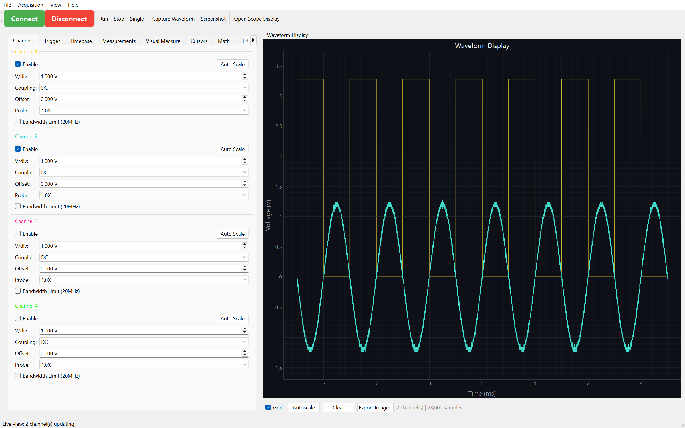

# SCPI Instrument Control

Welcome to the SCPI Instrument Control documentation! SCPI Instrument Control is a universal Python library for SCPI test equipment — oscilloscopes, function generators/AWGs, power supplies, and DAQ units — with a PyQt6 desktop GUI and a browser-based lab gateway.

You do not need an instrument to try it. Every example below runs against the built-in mock scope, and
this recording is of them actually doing so — each frame is captured by running the example, so it
cannot drift from what the code really prints:


<div class="grid cards" markdown>

- :material-clock-fast:{ .lg .middle } **Quick Start**

  ***

  Get up and running in minutes with our quick start guide

  [:octicons-arrow-right-24: Quick Start](getting-started/quickstart.md)

- :material-book-open-variant:{ .lg .middle } **User Guide**

  ***

  Learn how to use all features of the library

  [:octicons-arrow-right-24: User Guide](user-guide/basic-usage.md)

- :material-desktop-classic:{ .lg .middle } **GUI Application**

  ***

  Discover the powerful GUI for interactive control

  [:octicons-arrow-right-24: GUI Guide](gui/overview.md)

- :material-web:{ .lg .middle } **Web Gateway**

  ***

  Control instruments from any browser on your LAN — no client install

  [:octicons-arrow-right-24: Web Gateway](gateway/index.md)

- :material-api:{ .lg .middle } **API Reference**

  ***

  Complete API documentation for all modules

  [:octicons-arrow-right-24: API Docs](api/oscilloscope.md)

</div>

## Overview

This library provides comprehensive control for SCPI test equipment — oscilloscopes, function generators/AWGs, power supplies, and DAQ units — over Ethernet. It supports programmatic control through a Python API, interactive control through a feature-rich PyQt6 GUI, and a browser-based lab gateway for LAN-wide access.

### Supported Models

- **SDS800X HD Series** (e.g., SDS824X HD)
- **SDS1000X-E Series**
- **SDS2000X Plus Series**
- **SDS5000X Series**

### Key Features

=== "Programmatic Control"

    - **Waveform Acquisition** - Capture and analyze waveforms with full metadata
    - **Channel Control** - Configure voltage scale, offset, coupling, and probe settings
    - **Trigger Management** - Full control over trigger modes, levels, and edge detection
    - **Measurements** - 20+ automated measurements (frequency, Vpp, rise time, etc.)
    - **FFT Analysis** - Frequency domain analysis of captured waveforms
    - **Protocol Decoding** - Decode I2C, SPI, and UART protocols
    - **Automation** - High-level automation classes for data collection
    - **Data Provenance** - Every capture records the instrument, settings, and timestamp that produced it; read it back with `load_waveform()` or the `scpi-extract` CLI
    - **Synthetic Signals** - Generate parameterized waveforms (sine, square, triangle, ramp, DC, noise, chirp, exponential, pulse, multitone) with no instrument required; mock scopes synthesize state-coupled captures by default

=== "GUI Application"

    - **Real-time Live View** - High-performance waveform display (1000+ fps)
    - **Visual Measurements** - Click-and-drag measurement markers
    - **FFT Display** - Interactive frequency analysis
    - **Protocol Decoder** - Visual protocol decoding interface
    - **VNC Integration** - Remote access to oscilloscope screen
    - **Vector Graphics** - Draw shapes and text in XY mode
    - **Export** - Save waveforms to CSV, NPZ, MAT, HDF5, and images

=== "Advanced Features"

    - **Multi-channel** - Simultaneous capture from all channels
    - **Thread-safe** - Background data acquisition without blocking
    - **Type hints** - Full type annotation for IDE support
    - **Extensive tests** - 1,100+ automated tests
    - **Documentation** - Comprehensive docstrings and guides

## Installation

Install the base package:

```bash
pip install "SCPI-Instrument-Control"
```

Or install with all features:

```bash
pip install "SCPI-Instrument-Control[all]"
```

See the [Installation Guide](getting-started/installation.md) for more options.

## Quick Example

No instrument required — this runs as written:

```python
from scpi_control import Oscilloscope
from scpi_control.connection import MockConnection
from scpi_control.signal_synth import SignalSpec

# A virtual SDS1104X-E probing a 3.3 V, 1 kHz logic clock.
# For real hardware, drop the connection= argument and pass an address:
#     scope = Oscilloscope("192.168.1.100")
scope = Oscilloscope("mock", connection=MockConnection(
    "mock",
    channel_states={1: True},
    signals={1: SignalSpec(kind="square", frequency=1000.0, amplitude=1.65, offset=1.65)},
    sample_rate=20e6,
    timebase=500e-6,
))
scope.connect()

waveform = scope.get_waveform(channel=1)
print(f"{len(waveform.time)} samples")
print(f"Vpp  {waveform.voltage.max() - waveform.voltage.min():.3f} V")
print(f"Freq {scope.measurement.measure_frequency(1):.2f} Hz")
```

```text
14000 samples
Vpp  3.280 V
Freq 1000.00 Hz
```

## GUI Application

Launch the GUI with:

```bash
siglent-gui
```



## Documentation Structure

<div class="grid" markdown>

!!! info "Getting Started"
New to the library? Start here!

    - [Installation](getting-started/installation.md)
    - [Quick Start](getting-started/quickstart.md)
    - [Connection Setup](getting-started/connection.md)

!!! tip "User Guide"
Learn all the features

    - [Basic Usage](user-guide/basic-usage.md)
    - [Waveform Capture](user-guide/waveform-capture.md)
    - [Measurements](user-guide/measurements.md)
    - [Advanced Features](user-guide/advanced-features.md)

!!! example "Examples"
Real-world code examples

    - [Beginner Examples](examples/beginner.md)
    - [Intermediate Examples](examples/intermediate.md)
    - [Advanced Examples](examples/advanced.md)

!!! abstract "API Reference"
Detailed API documentation

    - [Oscilloscope](api/oscilloscope.md)
    - [Channel](api/channel.md)
    - [Trigger](api/trigger.md)
    - [Waveform](api/waveform.md)

</div>

## Community & Support

- **GitHub Issues**: [Report bugs or request features](https://github.com/little-did-I-know/SCPI-Instrument-Control/issues)
- **Discussions**: [Ask questions and share ideas](https://github.com/little-did-I-know/SCPI-Instrument-Control/discussions)
- **Contributing**: [Contribution guidelines](development/contributing.md)

## License

This project is licensed under the MIT License - see the [License](about/license.md) page for details.
