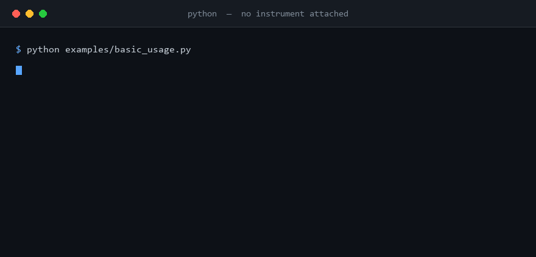
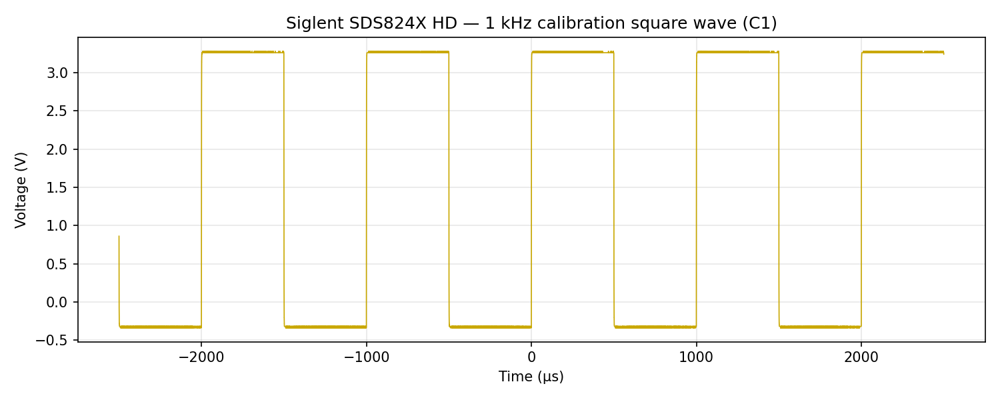

# SCPI Instrument Control — Examples

These scripts show the library in action end to end: oscilloscope capture and
analysis, the web gateway's REST API, function generator / AWG control,
power supply control, data acquisition, and report generation. Most run
against the built-in mock by default and need no instrument at all — pass
`--host <ip>` to point one at real hardware instead. A few run entirely
against mock connections with no real-hardware path at all, and three
genuinely cannot run without extra setup (a USB/VISA transport, a Qt display,
or a running web gateway) — those are called out below.

Here are four of them running back to back with nothing plugged in. Every frame is captured by
actually executing the example, so what you see is what the code really prints:



And here is a genuine capture from a **Siglent SDS824X HD** on the bench — its 1&nbsp;kHz
calibration square wave, acquired over LAN and plotted by the same automation API that
`waveform_capture.py` uses:



Install the core library, then add the extras a given example needs:

```bash
pip install "SCPI-Instrument-Control"
```

## Oscilloscope

| File | What it shows | Requirements |
| --- | --- | --- |
| `basic_usage.py` | Connecting to an oscilloscope, configuring channels and trigger, and performing basic operations. | None — runs on the built-in mock; `--host <ip>` for real hardware |
| `waveform_capture.py` | Capturing waveform data from the oscilloscope and saving it to a file. | None — runs on the built-in mock; `--host <ip>` for real hardware (matplotlib is a core dependency) |
| `screen_capture_example.py` | Pulling a screenshot off the instrument's display with `ScreenCapture` and saving the scope's native BMP to a file. | None — runs on the built-in mock; `--host <ip>` for real hardware |
| `measurements.py` | Automated measurements (frequency, Vpp, RMS, period, etc.) on oscilloscope channels. | None — runs on the built-in mock; `--host <ip>` for real hardware |
| `measurement_badges_example.py` | Tektronix MSO measurement badges: how `scpi_control` allocates a numbered badge for the first measurement of a given type/channel, reuses it on repeat calls, and deletes it on disconnect. Badges are a Tektronix-only concept. | None — runs on a built-in mock standing in for a **Tektronix MSO58** (not the default Siglent mock); `--host <ip>` for a real Tektronix MSO |
| `math_channels.py` | Waveform math: adding and subtracting two captured channels with `MathOperations`, computed in Python on captured samples rather than an instrument MATH channel. | None — runs on the built-in mock; `--host <ip>` for real hardware |
| `reference_waveforms.py` | Golden-reference comparison: saving a captured waveform as a named reference with `ReferenceWaveform`, then scoring a later capture against it with a correlation coefficient and a point-by-point difference. | None — runs on the built-in mock; `--host <ip>` for real hardware |
| `protocol_decoding.py` | Serial bus decoding: what channels and parameters the `I2CDecoder`, `SPIDecoder` and `UARTDecoder` classes need, then decoding a captured channel with `UARTDecoder`. The mock synthesizes analogue test signals rather than framed bus traffic, so the UART summary reflects that (see the module docstring for the exact, deterministic result). | None — runs on the built-in mock; `--host <ip>` for real hardware |
| `live_plot.py` | Real-time waveform acquisition and plotting using matplotlib animation, bounded to `--frames` updates. | None — runs on the built-in mock; `--host <ip>` for real hardware (matplotlib is a core dependency) |
| `simple_capture.py` | Single waveform capture with analysis via the automation API (Vpp, RMS, frequency) and saving to NumPy format. | None — runs on the built-in mock; `--host <ip>` for real hardware |
| `batch_capture.py` | Capturing multiple waveforms with different timebase and voltage-scale settings, for characterizing signals at different scales. | None — runs on the built-in mock; `--host <ip>` for real hardware |
| `continuous_capture.py` | Collecting waveforms continuously over a period of time, for monitoring, statistics, or time-varying phenomena. | None — runs on the built-in mock; `--host <ip>` for real hardware |
| `trigger_based_capture.py` | Waiting for specific trigger conditions and capturing waveforms when they occur, for sporadic events. | None — runs on the built-in mock; `--host <ip>` for real hardware |
| `advanced_analysis.py` | Advanced waveform analysis and visualization: FFT analysis, statistical analysis, and matplotlib plots. | None — runs on the built-in mock; `--host <ip>` for real hardware (matplotlib is a core dependency) |
| `probe_calibration_analysis.py` | Waveform region extraction for probe compensation analysis: plateau detection, slope analysis, calibration guidance, and zoomed PDF report plots. | `SCPI-Instrument-Control[report-generator]` (no hardware — fully synthetic) |
| `dialect_override_example.py` | SCPI dialect auto-detection from `*IDN?` and the `dialect=` override for forcing a command set; runs entirely on mock connections. | Core install only (no hardware) |
| `waveform_provenance_and_extract.py` | Acquisition provenance: capturing a waveform with the instrument/settings snapshot attached, saving NPZ and CSV, and reading them back with `load_waveform()`; runs entirely against a mock connection -- no instrument needed. | Core install only (no hardware) |
| `synthetic_signals.py` | Generating parameterized test waveforms with `SignalSpec`/`make_waveform`, and a mock oscilloscope session whose captures respond to SCPI writes (timebase, voltage scale) via state-coupled synthesis; runs entirely against a mock connection - no instrument needed. | Core install only (no hardware) |

## Web Gateway

| File | What it shows | Requirements |
| --- | --- | --- |
| `gateway_rest_client.py` | Driving the web gateway's REST API from Python: creating a mock session, configuring a channel, fetching waveform JSON, downloading a screenshot, and sending a raw SCPI command — the same API the browser UI uses. | `SCPI-Instrument-Control[web]` + a running `scpi-web` gateway **(not executed in CI)** |
| `trend_logging_walkthrough.py` | Recording measurement trends in-process via the gateway's session layer (no server or browser): polling measurements, recording them, and exporting to CSV. | Core install only (no hardware, no server) |
| `network_discovery.py` | Scanning the network for SCPI instruments via `discovery.discover()`: probes a CIDR range for `*IDN?` responses and lists what it finds. | `SCPI-Instrument-Control` (core install, no hardware) |

## Function Generator / AWG

| File | What it shows | Requirements |
| --- | --- | --- |
| `function_generator_basic.py` | Basic control of Siglent SDG-series function generators over Ethernet/LAN. | None — runs on the built-in mock; `--host <ip>` for real hardware |
| `vector_graphics_xy_mode.py` | Using the oscilloscope as a vector display: generating X/Y waveform data for shapes, saving waveform files for an AWG, and animating via rotation/transforms. Generation and file-writing run headless; an external AWG/DAC is only needed to actually display the shapes on a scope. | None — runs on the built-in mock; `--host <ip>` for real hardware. `SCPI-Instrument-Control[fun]` additionally needed for the text-rendering demo (skipped with a warning if absent) |
| `awg_scope_loopback.py` | Two mock instruments joined by one virtual cable: `AwgLoopback` makes a mock scope's capture respond live to a mock AWG's SCPI state, optionally through an `RCLowPass` device-under-test model that rounds the edges of whatever the AWG outputs. | Core install only (no hardware — both instruments are mocks with no real-hardware path) |
| `frequency_response_sweep.py` | Measuring a frequency response end to end: a mock AWG drives an `RCLowPass` device model, the mock scope autoranges and captures the response at each swept frequency, and the measured corner is compared against the analytic one. | Core install only (no hardware — both instruments are mocks with no real-hardware path) |

## Power Supply

| File | What it shows | Requirements |
| --- | --- | --- |
| `psu_basic_control.py` | Controlling a SCPI power supply (Siglent SPD series or generic SCPI-99) over Ethernet/LAN. | None — runs on the built-in mock; `--host <ip>` for real hardware |
| `psu_advanced_features.py` | Advanced PSU features: CSV data logging, tracking modes (series/parallel), timer functionality, waveform generation, and OVP/OCP protection. | Core install only (no hardware — uses a mock connection) |
| `psu_usb_connection.py` | Connecting to a power supply via USB/GPIB/Serial/TCP-IP using `VISAConnection`. | `SCPI-Instrument-Control[usb]`, PSU reachable via USB-TMC/GPIB/Serial/VXI-11 **(not executed in CI)** |
| `psu_gui_test.py` | Testing the PSU control GUI against a mock connection, with no physical hardware required. | `SCPI-Instrument-Control[gui]` **(not executed in CI)** |

## Data Acquisition

| File | What it shows | Requirements |
| --- | --- | --- |
| `data_logger_basic.py` | Basic usage of the `DataLogger` class for DAQ/switch units (e.g. Keysight 34970A/DAQ970A style). | None — runs on the built-in mock; `--host <ip>` for real hardware |

## Report Generator

| File | What it shows | Requirements |
| --- | --- | --- |
| `report_generation_example.py` | Generating professional PDF/Markdown test reports: synthesizing waveform data with numpy, adding measurements with pass/fail criteria, optional AI analysis, and rendering the report. | `SCPI-Instrument-Control[report-generator]` (no hardware - fully synthetic) |
| `report_computed_analysis.py` | Deterministic, LLM-free report analysis: `ComputedAnalyzer` fills the executive summary, key findings, and recommendations from the waveform data with no model or network. | `SCPI-Instrument-Control[report-generator]` (no hardware) |
| `report_branding.py` | Applying a `BrandingTemplate` to a report: company name, header/footer text, and a brand colour scheme, rendered to a branded Markdown report and a colour-branded PDF. | `SCPI-Instrument-Control[report-generator]` (no hardware) |
| `comparison_report.py` | Before/after comparison report: two synthetic captures run through `RunSet` → `ComparisonAnalyzer` → `build_comparison_report()`, with a `CriteriaSet` flagging an amplitude regression, an overlay plot, a Delta/Delta% table, a SHA-256 raw-data manifest, and a sign-off block. | `SCPI-Instrument-Control[report-generator]` (no hardware - fully synthetic) |
| `batch_report.py` | Batch report across five synthesized DUTs, one a deliberate outlier: `MODE_BATCH` comparison with per-DUT pass/fail, cross-run aggregate statistics, and a yield figure in the executive summary. | `SCPI-Instrument-Control[report-generator]` (no hardware - fully synthetic) |
| `report_ai_qa.py` | Interactive Q&A over a report with a local LLM using tool-calling: the model calls the report's analysis tools to answer, and the example degrades cleanly when no tool-capable Ollama model is running. | `SCPI-Instrument-Control[report-generator]`; optional local Ollama (no hardware) |

## Interactive Tutorial

| File | What it shows | Requirements |
| --- | --- | --- |
| `interactive_tutorial.ipynb` | End-to-end Jupyter walkthrough: connect, configure channels/trigger, capture and plot a waveform, run automated measurements, FFT analysis, multi-channel capture, and export — narrated step by step. | Jupyter, oscilloscope on the network (matplotlib and scipy are core dependencies) |

## Configuration

Every oscilloscope/AWG/PSU/DAQ example takes `--host <ip>`, defaulting to
`mock` — run any of them with no arguments and they work against the
built-in mock, no setup required. Pass `--host <ip>` (or `--host <hostname>`)
to point one at a real instrument instead. To find an oscilloscope's LAN
address: **Utility → I/O → LAN** on the instrument's front panel.

The scripts marked "no hardware" above don't take a `--host` flag at all —
they run entirely against a mock connection or fully synthetic data, with no
real-hardware code path to opt into. The three marked
`**(not executed in CI)**` are different again: each needs something a
`--host` flag can't supply — a USB/VISA transport, a Qt display, or a running
`scpi-web` gateway.

## Running an example

```bash
python examples/basic_usage.py
```

On Windows terminals with a legacy codepage, set `PYTHONIOENCODING=utf-8` first if a script prints Unicode symbols.

For `gateway_rest_client.py`, start the gateway first, in another terminal:

```bash
pip install "SCPI-Instrument-Control[web]"
scpi-web
```

Then, back in your first terminal, mint a token for the script (`token add` is
the credential for scripts and CI; people sign in with `scpi-web invite <name>`
instead) and export it before running the client:

```bash
scpi-web token add rest-demo     # prints the token once
export SCPI_WEB_TOKEN=scpi_...   # the token it printed
python examples/gateway_rest_client.py
```
